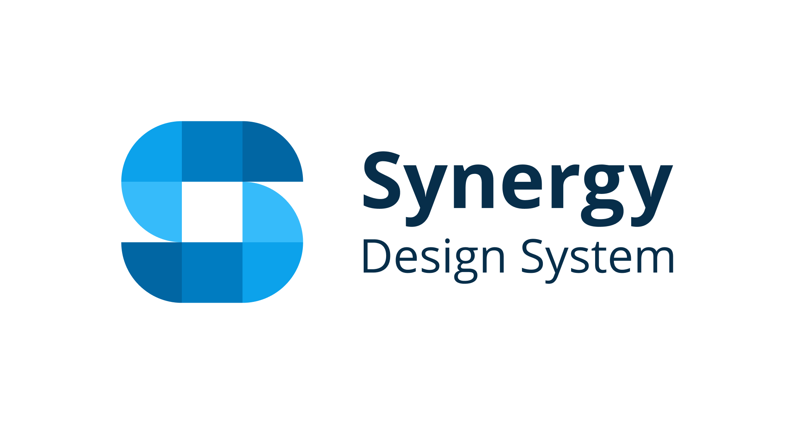

# Synergy

<picture>
  <source media="(prefers-color-scheme: dark)" srcset="./packages/docs/public/synergy_logo_dark.png" width="400">
  
</picture>

Welcome to the home of the Synergy. Synergy is the foundation to efficiently build a consistent digital landscape for SICK.

This project is mainly intended for usage in [SICK](https://www.sick.com) applications to ensure a unique look and feel across applications, however you may also use it [for your own projects for free](./LICENSE) as well.

## Documentation

The documentation is always up-to-date and can be found on https://synergy-design-system.github.io/ .

## Source code

The code resides on GitHub: https://github.com/synergy-design-system/synergy-design-system .

## Packages

This repository is comprised of several sub-packages.
|package|description|
|--|--|
|tokens|design tokens which contain basic design variables for colors, spacings, sizes, fonts etc. They are always in sync with the Figma library, and the base for CSS styles|
|assets|icons and logos|
|components|user interface components based on custom elements and lit|
|docs|storybook documentation showing all components and their properties in an interative environment |
|angular|angular wrappers for better DX in Angular (auto generated)|
|react|react wrappers for better DX in React (auto generated)|
|vue|vue wrappers for better DX in VueJS (auto generated)|

---

## Development environment

SDS uses a monorepo setup, using [node.js](https://nodejs.org) as a runtime and [pnpm](https://pnpm.io) for dependency management and build scripts. If not already installed, install and configure these tools.

1. `pnpm install --recursive` installs all dependencies.
2. `pnpm build` in the root directory forces a build all packages that provide a build job.
3. `pnpm lint` in the root directory will run all configured lint jobs.
